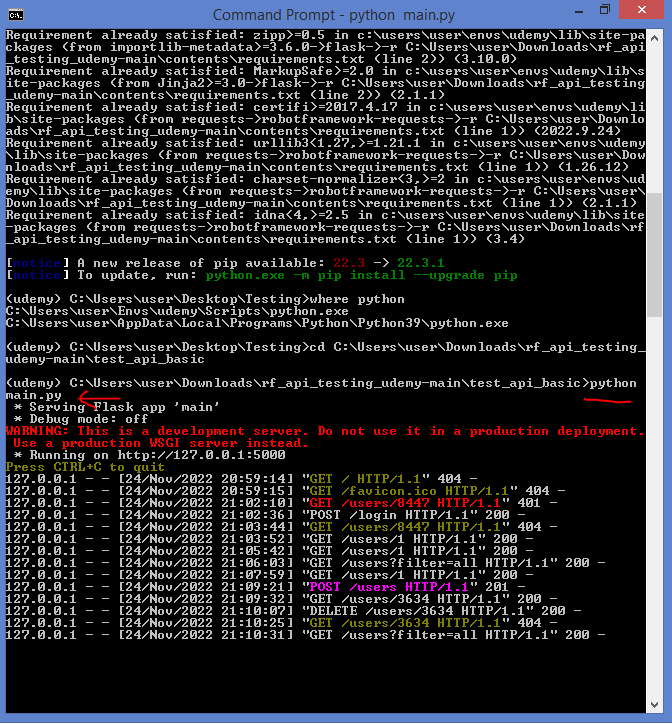
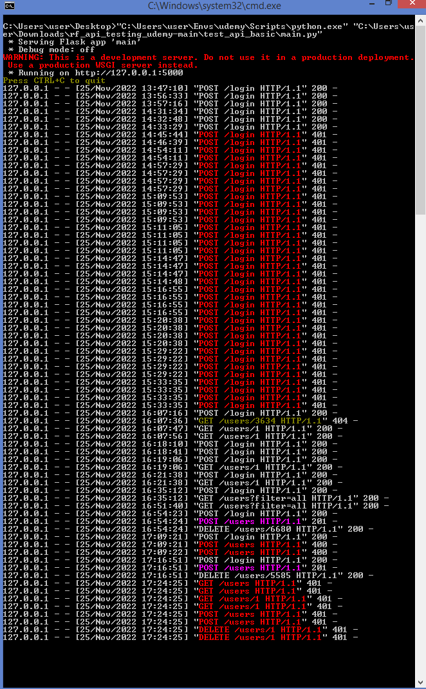
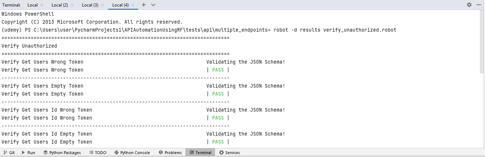
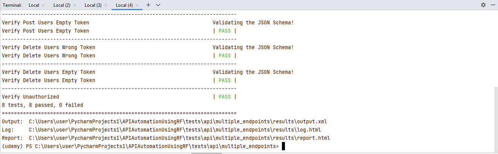

# API Automation using RobotFramework

This project has the Step-by-Step process to setup API server and Create the API Automation Framework from scratch.


## This Code base contains following Items

 - APIs Code for Testing
 - Postman Collection
 - RobotFramework devloped for API Automation
 - [Inspired By Sven Ernst](https://gitlab.com/sveneFX/rf_api_testing_udemy/-/tree/main/rf_code_basic/keywords)


## Step-1

Clone the Complete Project 

Navigate to test_api_basic and run the batch file to start the API server




Open the Postman and import the collection

Test all the API requests manually and confirm

## Step-2

Navigate to the APIAutomationUsingRF and open it in the Pycharm/VS code IDE and set the virtual environment

Move on to the Contents folder requirements.txt and run the below code to install all the dependencies

```
pip install -r requirements.txt
```

In the APIAutomationUsingRF/tests/api/endpoints/ path you can find the tests for different scenarios

Use the below command to run it and view the respective log report.

```python
robot-d results *.robot
```



